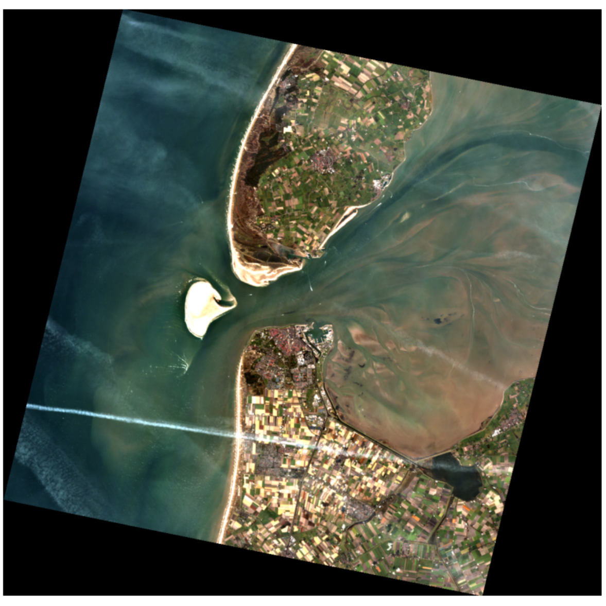
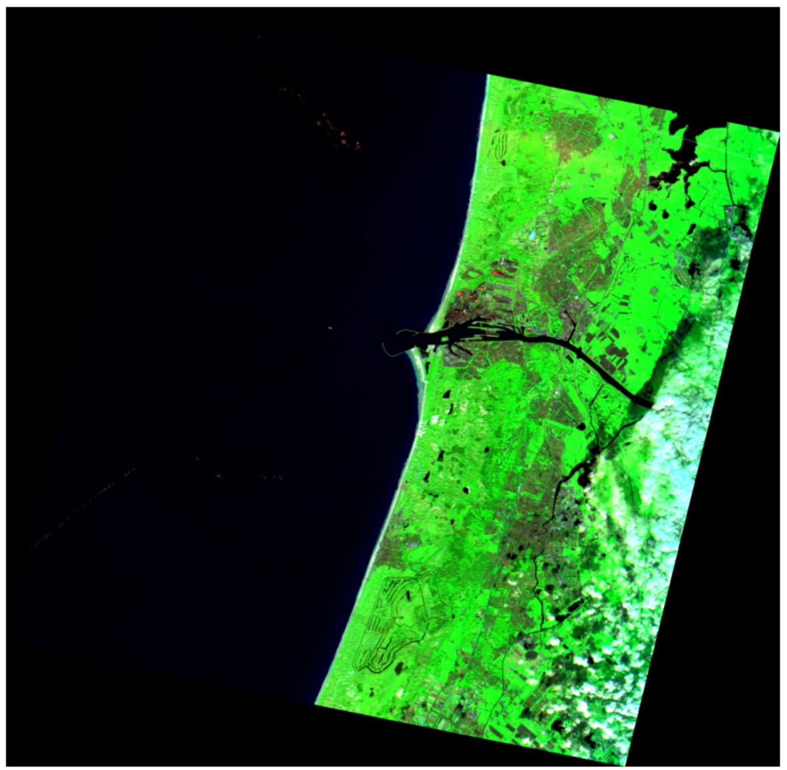
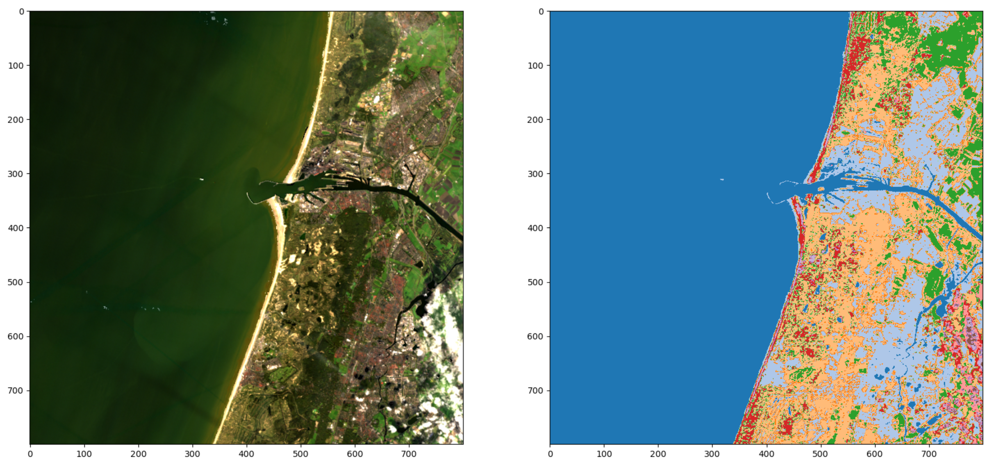
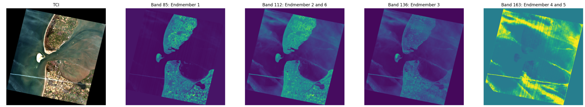
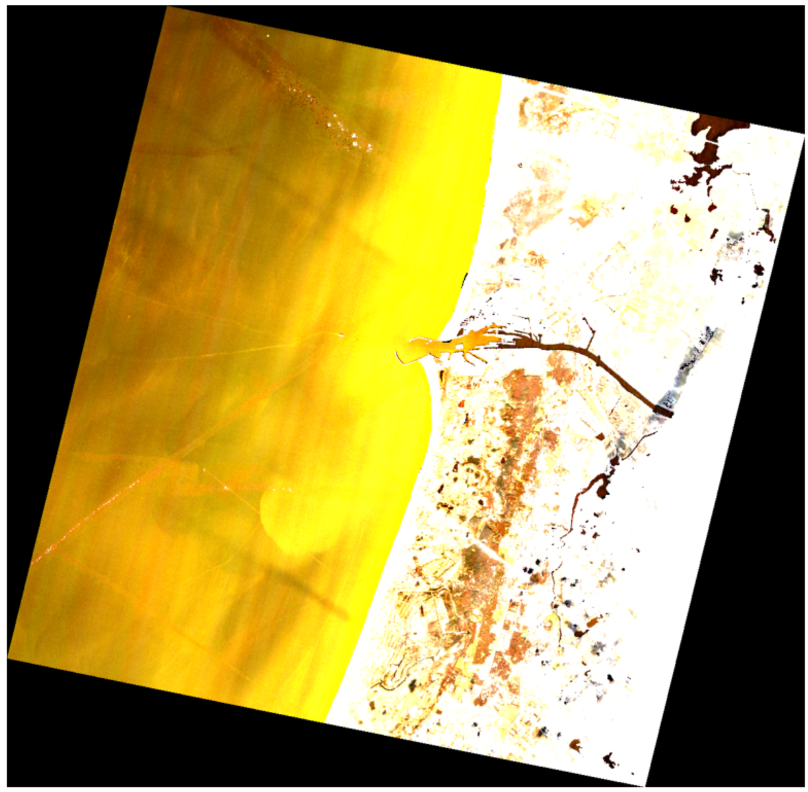

# hyperspectral_oefendag
Geo-oefendag 14-07-2023

Here we used data from the German <a href="https://www.enmap.org/" target="_blank">EnMAP</a> mission to begin understanding how to work with hyperspectral imagery data.

Some cool examples of our results:

**True Colour Image (TCI)**:

**False Colour Image (SWIR, NIR and red)**:

**K-Means clustering**:

**NFINDER-algorithm endmember (=entity) detection results**:

**Very pretty golden shiny image**:

